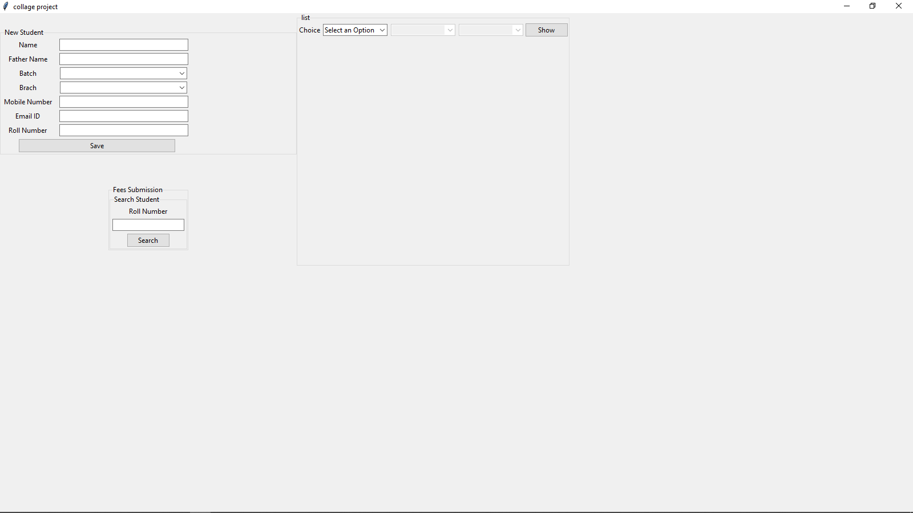

# Fees Management System

#### This software is for managing fees data in B tech colleges. This was developed in python (tkinter) and use SQL-light for storing data and it has a email services for notification.

### Downloading 

#### For downloading this projects you just clone it by
``git clone https://github.com/yashrasniya/fees_management_system``    

after this download all req module by
``pip install -r req.txt``

### Run
``python main.py``

and enjoy the program 

